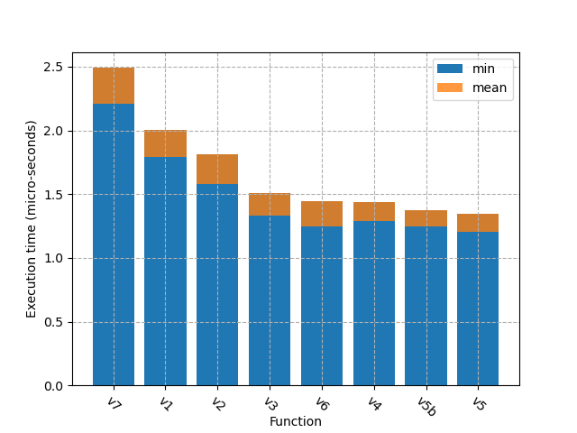

# Fizzbuzz

## Scenario

Fizzbuzz is one of the classic coding questions. We need to write a function that will:
* Output 'fizz' if the value is divisble by 3
* Output 'buzz' if the value is divisble by 5
* Output 'fizzbuzz' if the value is divisble by both 5 and 3

But let's make it a little more challenging. Not only do we need to have correctness, we need to process the value as quickly as possible. Maybe there are serious financial rewards for every extra microsecond we can reclaim in our program.

## The script

In `funcs.py`, there are a number of fizzbuzz functions. The `main.py` script runs each of them a large number of times (configurable) and returns both the minimum* execution time and the average execution time. A chart is then made of all results.

*The minimum time represents the true time complexity of the program, with fewest other system interruptions, while the average reflects the real-world timing.

This was a fun exercise in optimising a very basic function in python.

# Results

```
fizzbuzz_v1 : Min=1.749984 µs, Avg=2.228595 µs
fizzbuzz_v2 : Min=1.665991 µs, Avg=1.895005 µs
fizzbuzz_v3 : Min=1.332985 µs, Avg=1.564885 µs
fizzbuzz_v4 : Min=1.291977 µs, Avg=1.542607 µs
fizzbuzz_v5 : Min=1.207984 µs, Avg=1.399696 µs
fizzbuzz_v5b: Min=1.290988 µs, Avg=1.478605 µs
fizzbuzz_v6 : Min=1.290988 µs, Avg=1.439276 µs
fizzbuzz_v7 : Min=2.249988 µs, Avg=2.470572 µs
```



The `v1` approach is probably as simple / basic as it gets, and takes around 2.23µs to run. By using incrementally more performant techniques (early returns, nested logic and removing unnecessary conditionals), I was able to make the function 59% faster, to run in 1.40µs.

## Are there even more performant methods?

Write your code and let me know if you beat my fastest time!
